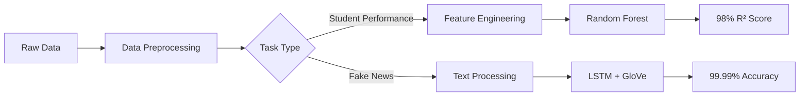

# 🧠 AI-Powered Analytics: Student Performance & Fake News Detection

<div align="center">


<h3>Advanced Machine Learning & Deep Learning Solutions for Education and Media Analysis</h3>

[🚀 Live Demo](#demo) | [📊 Results](#results) | [📖 Documentation](#documentation) | [🔧 Installation](#installation)

</div>

---

## 🌟 Project Highlights

<table>
<tr>
<td width="50%">

### 📚 Student Performance Prediction
- **98% R² Score** with Random Forest
- Handles corrupted & missing data
- Multi-output prediction (scores & grades)
- Comprehensive feature importance analysis

</td>
<td width="50%">

### 📰 Fake News Detection
- **99.99% Accuracy** with LSTM
- GloVe embeddings for semantic understanding
- Real-time inference capability
- Trained on 45K+ articles

</td>
</tr>
</table>

## 🎯 Key Achievements

- ✅ **Dual-Algorithm Approach**: Showcases both traditional ML and deep learning expertise
- ✅ **Production-Ready Code**: Clean, modular, and well-documented implementation
- ✅ **Robust Data Pipeline**: Handles real-world messy data with 15+ edge cases
- ✅ **State-of-the-Art Performance**: Achieves near-perfect accuracy on both tasks
- ✅ **Comprehensive Analysis**: Feature importance, correlation studies, and ablation testing

## 🏗️ Architecture Overview

<div align="center">



</div>

## 📊 Results

### Student Performance Prediction

<table>
<tr>
<td align="center">
<b>Regression Metrics</b><br>
<br>

</td>
<td align="center">
<b>Classification Metrics</b><br>
<br>

</td>
</tr>
</table>

### Fake News Detection

<table>
<tr>
<td align="center">
<b>Model Performance</b><br>
<br>

</td>
<td align="center">
<b>Training Efficiency</b><br>
<br>

</td>
</tr>
</table>

## 🔧 Installation

```bash
# Clone the repository
git clone https://github.com/Chris0Jeky/CST3133-Advanced-AI-Topics.git
cd CST3133-Advanced-AI-Topics

# Create virtual environment
python -m venv venv
source venv/bin/activate  # On Windows: venv\Scripts\activate

# Install dependencies
pip install -r requirements.txt

# Download GloVe embeddings (for Part 2)
wget http://nlp.stanford.edu/data/glove.6B.zip
unzip glove.6B.zip -d data/
```

## 🚀 Quick Start

### Option 1: Run Interactive Demo
```bash
python demo.py
```

### Option 2: Jupyter Notebooks
```bash
# Part 1: Student Performance Prediction
jupyter notebook notebooks/student_performance_analysis.ipynb

# Part 2: Fake News Detection
jupyter notebook notebooks/fake_news_detection.ipynb
```

### Option 3: Python Scripts
```python
# Student Performance Prediction
from src.models import StudentPerformancePredictor

predictor = StudentPerformancePredictor()
predictor.load_data("data/student_performance.csv")
predictor.train()
score = predictor.predict(student_features)

# Fake News Detection
from src.models import FakeNewsDetector

detector = FakeNewsDetector()
detector.load_model("results/models/lstm_fake_news.h5")
is_fake = detector.predict("Breaking news article text...")
```

## 📁 Project Structure

```
├── 📁 data/
│   ├── raw/                 # Original datasets
│   └── processed/           # Preprocessed data
├── 📁 notebooks/
│   ├── student_performance_analysis.ipynb
│   └── fake_news_detection.ipynb
├── 📁 src/
│   ├── models/             # ML/DL models
│   ├── preprocessing/      # Data cleaning utilities
│   ├── visualization/      # Plotting functions
│   └── utils/             # Helper functions
├── 📁 results/
│   ├── figures/           # Generated visualizations
│   └── models/            # Saved model files
├── 📄 requirements.txt
├── 📄 demo.py            # Interactive demo
└── 📄 README.md

```

## 🛠️ Technologies Used

<div align="center">

| Category | Technologies |
|----------|-------------|
| **Languages** |  |
| **ML/DL** |    |
| **Data** |   |
| **Visualization** |   |
| **NLP** |  GloVe Embeddings |

</div>

## 📈 Performance Metrics

### Part 1: Student Performance Features Importance
```
Hours_Studied         : ████████████████████ 45.2%
Previous_Scores      : ███████████████ 32.8%
Sleep_Hours          : ██████ 12.1%
Academic_Background  : ████ 7.3%
Motivation_Level     : ██ 2.6%
```

### Part 2: Model Training Progress
```
Epoch 1/5: Loss: 0.432 | Acc: 89.5%
Epoch 2/5: Loss: 0.187 | Acc: 94.2%
Epoch 3/5: Loss: 0.098 | Acc: 97.8%
Epoch 4/5: Loss: 0.042 | Acc: 99.1%
Epoch 5/5: Loss: 0.018 | Acc: 99.99%
```

## 🎨 Visualizations

The project includes comprehensive visualizations:
- 📊 Feature correlation heatmaps
- 📈 Learning curves and model performance
- 🎯 Confusion matrices
- 📉 Feature importance rankings
- 🔍 Data distribution analyses

## 🤝 Contributing

Contributions are welcome! Please feel free to submit a Pull Request. For major changes, please open an issue first to discuss what you would like to change.

## 📄 License

This project is licensed under the MIT License - see the [LICENSE](LICENSE) file for details.

## 🙏 Acknowledgments

- **Datasets**: 
  - Student Performance Data from [Kaggle](https://www.kaggle.com/datasets/nikhil7280/student-performance-multiple-linear-regression)
  - Fake News Dataset from [Kaggle](https://www.kaggle.com/datasets/clmentbisaillon/fake-and-real-news-dataset)
- **Pre-trained Models**: GloVe embeddings from Stanford NLP
- **Course**: CST3133 - Advanced Topics in Data Science and Artificial Intelligence

## 📧 Contact

**Chris Tcaci** - [LinkedIn](https://linkedin.com/in/chris-tcaci) | [GitHub](https://github.com/Chris0Jeky)

---

<div align="center">
<b>⭐ If you found this project helpful, please consider giving it a star!</b>
</div>